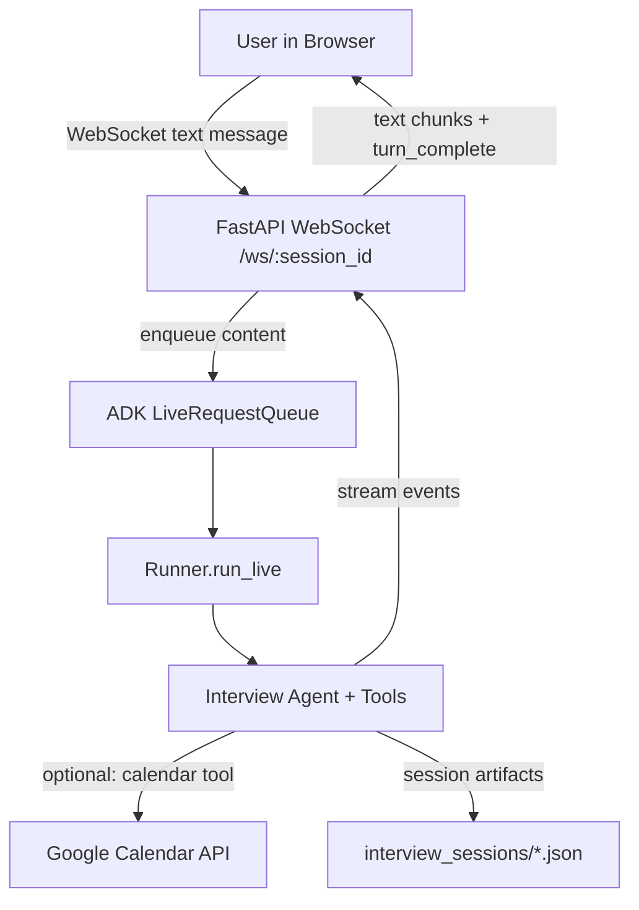
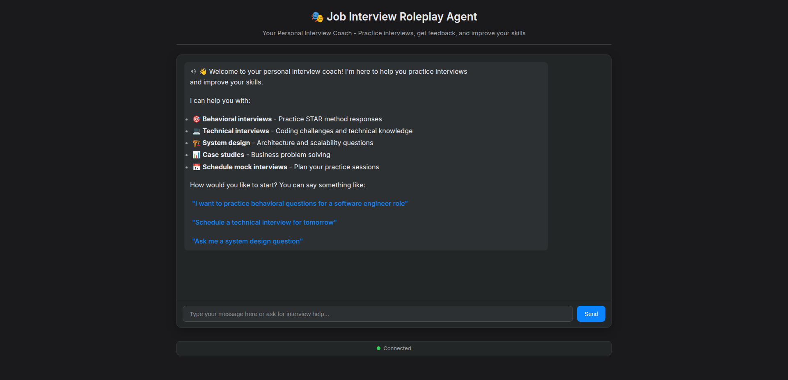

# Job Interview Agent

Text-first interview coaching assistant built with **FastAPI** + **Google ADK** (Agent Development Kit). It provides structured mock interview workflows (behavioral/technical/system design/case study) and optional Google Calendar scheduling.

## Project Overview

This repository contains:

- A lightweight browser chat UI (static HTML/JS)
- A FastAPI backend with a WebSocket endpoint for chat
- A Google ADK agent with tools for interview sessions, scoring, and reporting
- Optional Google Calendar integration for scheduling practice sessions


## Features (current)

- **Mock interview sessions**: behavioral, technical, system design, and case study flows
- **Question bank**: JSON-driven question library
- **Session persistence**: interview session state saved as JSON artifacts (local dev)
- **Performance report generation**: structured assessment output
- **Calendar integration (optional)**: schedule / list / update interviews via Google Calendar OAuth

## Tech stack

- **Backend**: FastAPI, Uvicorn
- **Frontend**: Static HTML/CSS/JavaScript (no framework)
- **AI/LLM**: Google ADK + Gemini (via `GOOGLE_API_KEY`)
- **Integrations**: Google Calendar API (optional)
- **Storage**: local JSON files for interview sessions (dev default)

## System architecture



## Installation guide

### Prerequisites

- Python **3.9+** recommended
- Google AI Studio / Gemini API key
- (Optional) Google account + OAuth credentials for Calendar integration

### 1) Setup

```bash
# Navigate to the job interview agent directory
cd job-interview-agent

# Create virtual environment
python -m venv .venv

# Activate virtual environment
.venv\Scripts\activate          # Windows (PowerShell)
source .venv/bin/activate       # macOS/Linux

# Install dependencies
pip install -r requirements.txt
```

### 2) Configure environment variables

Copy `.env.example` to `.env` and fill in:

```bash
cp .env.example .env
```

At minimum, set:

- `GOOGLE_API_KEY`

### 3) Run the app

```bash
# Start the server
cd app
uvicorn main:app --reload --host 0.0.0.0 --port 8000
```

Open:

- `http://localhost:8000`

## Google Calendar integration (optional)

1. Create OAuth 2.0 credentials in Google Cloud Console (Calendar API enabled)
2. Save the file as `credentials.json` in the repo root
3. Run:

```bash
python setup_calendar_auth.py
```

## Usage

- Type what you want to practice (role, interview type, difficulty, time)
- The agent will guide you into a session and can generate a report

## Environment variables

See `.env.example`. The key variables are:

- `GOOGLE_API_KEY` (required)
- `GOOGLE_CALENDAR_ID` (optional; required only if using calendar tools)


## Screenshots



